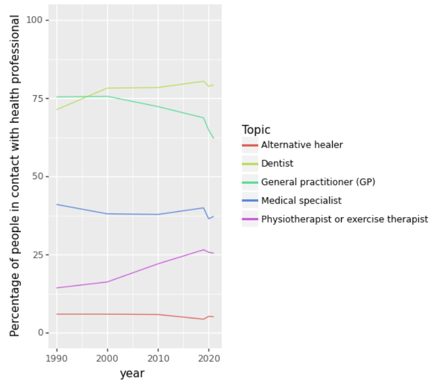
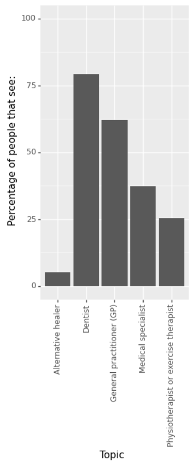
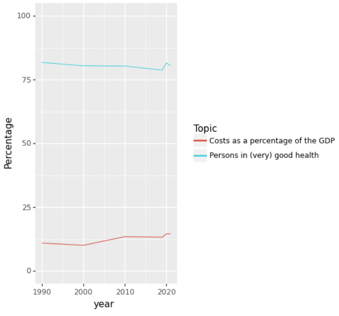
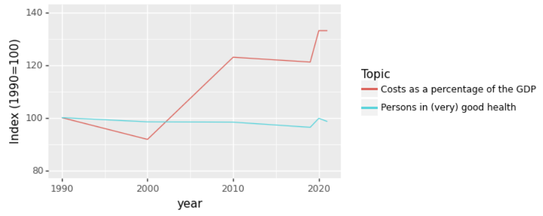

--- 
# Post-workshop exercise
## Introduction
### Goal of this exercise
We hope that after completing this exercise you have an idea of what it takes to analyse and visualize real-world data in python 
and that you can apply the learned skills to your own projects. 

### Dataset
For this exercise we use the 'health, lifestyle, health care use and supply, causes of death; from 1900' dataset from CBS opendata.

You can get a visual overview of the data [here]( https://opendata.cbs.nl/statline/#/CBS/en/dataset/37852eng/table?ts=1671446345991). 
For this exercise please download 
[this .csv file](https://raw.githubusercontent.com/esciencecenter-digital-skills/2023-01-25-ds-python-rivm/main/data/Health__lifestyle__health_care_use_and_supply__causes_of_death__from_1900_21122022_143458.csv).
You can right-click and press 'save as' to download it.
We slightly adapted the format of the data so that it is easier to read into pandas. 
**NB: Depending on your browser and operating system the file might be downloaded as a .txt extension. This should be .csv. You can just rename the extension to .txt**

### Challenging open questions
The questions are deliberately challenging with little guidance.
In addition, this is quite a challenging dataset to work with and it is quite different from the one used in the course. 
That is on purpose, we want this exercise to resemble your daily work as much as possible.
We want you to independently think what steps you need to take to reach your goal 
and get into a habit of searching the internet (including stackoverflow!) if you are stuck. 

### Guided version of the exercise
At the same time we do not want you to feel completely lost, 
so we have created a document with much more extra guidance on how to approach the questions.
If you are stuck for longer than 30 minutes, and you feel like you are not learning anything: 
Just have a look at [the guided version of the post workshop exercise](./guided-post-workshop-exercise.html).
You can also ask Jurriaan (jurriaan.biesheuvel@rivm.nl), Xiaoheng (xiaoheng.huang@rivm.nl), or Markus (markus.viljanen@rivm.nl) for help.
We expect you to take about 1 day to finish the exercise. See how far you get.

### Document what you are doing
Imagine you have the task to explore the dataset and present your findings to your colleagues in a jupyter notebook. 
So make the graphs as readable as possible, and put some clarifying documentation in markdown cells around your code, it is good to practice this.

## 1. Plotting contacts with health professionals
We will look at the 'Use of health care services|Contacts with health professionals' data. 
We want to get a visual overview of how many people have contact with health professionals.
**You need to load, explore, clean, and transform the data to solve these questions**, the actual plotting of the data itself is
just the final step.

### 1a: Linegraph health care contacts over time
Create a linegraph that shows the percentage of people having contact with a health professional for each category over time. 
The different categories (General practitioner (GP), Medical specialist, Dentist, 
Physiotherapist or exercise therapist, and Alternative healer)
should show as different colored lines in the linegraph.
This is what it should look like:

### 1b: Bargraph health care contacts 2021
Create a bargraph that shows the percentage of people having contact with a health professional for each category 
(General practitioner (GP), Medical specialist, Dentist, Physiotherapist or exercise therapist, and Alternative healer) in **2021**. 
This is what it should look like:

## 2. Health costs
One would expect that the percentage of people in good health would increase when the costs of our health system go up, is that true?
### 2a: Costs and health over time
Create a lineplot with the years on the x-axis and percentage y-axis. 
One line should represent the health costs as a percentage of the GDP, 
while the other line should show the percentage of people in (very) good health. 
Is this a good way of visualizing the data? And can you think of a better way (without looking at the next question ;) )
The plot should look like this:

### 2b Indexed costs and health over time
One way to visualize this data in a better way is to index it based on 1990. 
We make the values in 1990 100, and then for later years take the value relative to the value in 1990.
Calculate the indexed data and plot it in a lineplot.
The plot should look like this:

## 3. Bonus question: another dataset
Have a look at the [other CBS opendata datasets](https://opendata.cbs.nl/statline/#/CBS/en/navigatieScherm/thema). 
Pick a dataset that you like. Come up with interesting questions about the data and try to answer them using Python.

